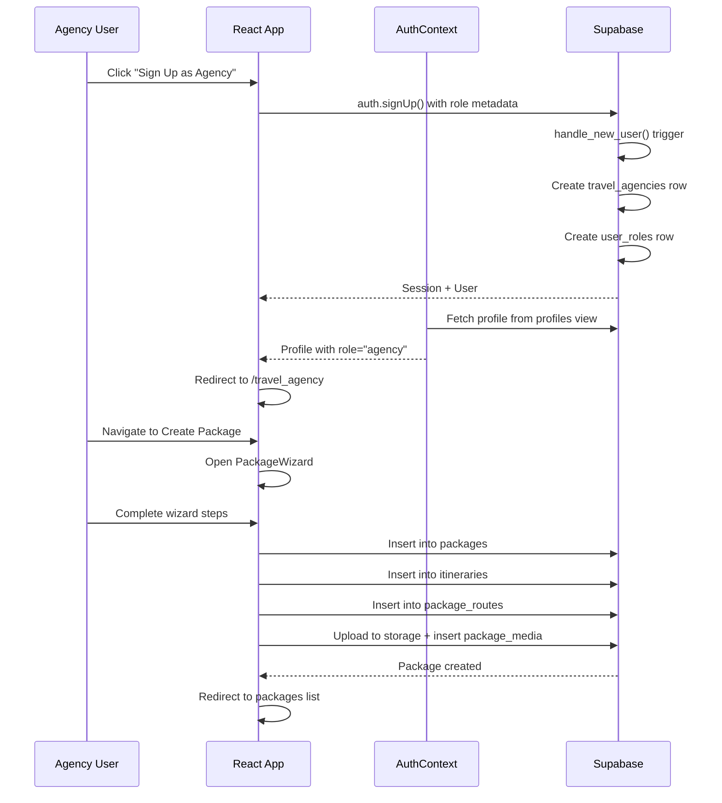
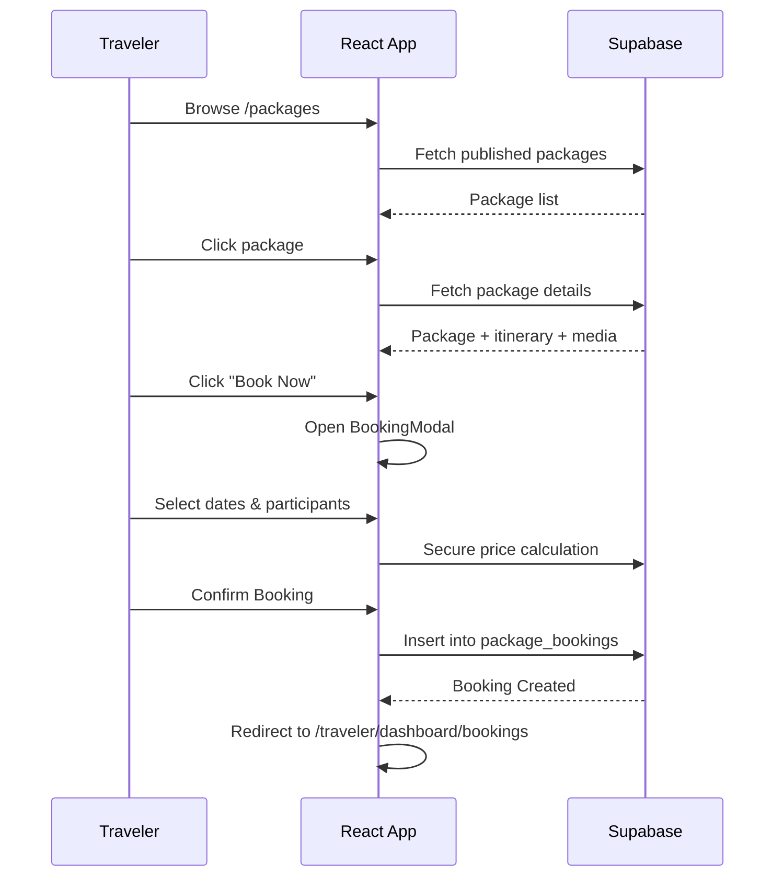
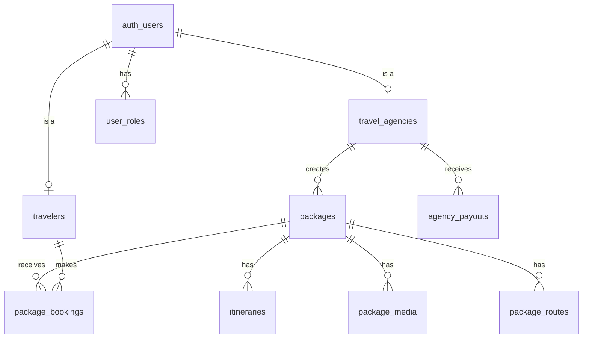

# Product Requirements Document (PRD)
## Tour Vendor Hub - Current State Analysis

**Document Version:** 1.0  
**Date:** January 6, 2026  
**Document Type:** Implementation-Driven PRD (As-Is State)

---

## Executive Summary

Tour Vendor Hub is a multi-tenant tour management platform connecting travel agencies with travelers. Built with React 18, TypeScript, Vite, and Supabase, the platform enables agencies to create and manage tour packages while travelers can browse, book, and review tours.

> [!CAUTION]
> This PRD documents the **actual implemented state** of the codebase, not aspirational features. Features marked as "Partial" or "Stubbed" have code present but are not fully functional.

---

# Phase 1: Product Overview (Current Reality)

## What the Product Does Today

| Capability | Status | Notes |
|------------|--------|-------|
| Multi-role authentication | ✅ Complete | Admin, Agency, Traveler roles with separate flows |
| Tour package CRUD | ✅ Complete | Full create, read, update, delete for agencies |
| Public tour browsing | ✅ Complete | Filtering, sorting, search implemented |
| Package detail views | ✅ Complete | Itinerary, media, pricing display |
| Booking creation | ✅ Complete | Full flow with date/participant selection (no payment yet) |
| Wishlist | ⚠️ Partial | UI ready, persistence missing |
| Reviews & ratings | ✅ Complete | Database persistence, rating calculations, and photo support |
| Agency Calendar | ✅ Complete | Visualized booking management for agencies |
| Payment integration | ❌ Not Implemented | No payment gateway |
| Notifications | ❌ Not Implemented | No email/push system |
| Admin moderation | ⚠️ Partial | Dashboard exists, actions limited |

## Technology Stack

| Layer | Technology | Version |
|-------|------------|---------|
| Frontend Framework | React | 18.3.1 |
| Build Tool | Vite | 5.4.1 |
| Language | TypeScript | 5.5.3 |
| Styling | Tailwind CSS + shadcn/ui | 3.4.11 |
| State Management | TanStack React Query | 5.56.2 |
| Routing | React Router DOM | 6.26.2 |
| Backend | Supabase (PostgreSQL) | 2.50.0 |
| Forms | React Hook Form + Zod | 7.53.0 / 3.23.8 |
| i18n | i18next | 25.7.3 |
| Maps | Mapbox GL | 3.17.0 |

---

# Phase 2: User Roles & Permissions

## Role Matrix

| Role | Authentication | Dashboard | Key Capabilities |
|------|---------------|-----------|------------------|
| **Traveler** | `/auth?type=traveler` | `/traveler/dashboard` | Browse tours, book, wishlist, reviews |
| **Agency** | `/auth?type=agency` | `/travel_agency` | Package CRUD, booking management, analytics |
| **Admin** | `/admin/login` (hidden) | `/admin` | Platform management, user oversight |

## Role: Traveler

### Permissions Implemented

| Action | UI | API | DB | Status |
|--------|:--:|:---:|:--:|--------|
| View published packages | ✅ | ✅ | ✅ | Complete |
| View package details | ✅ | ✅ | ✅ | Complete |
| Create booking | ✅ | ✅ | ✅ | Complete (Excl. Payment) |
| View own bookings | ✅ | ✅ | ✅ | Complete |
| Add to wishlist | ⚠️ | ❌ | ❌ | Partial - UI only, no persistence |
| Submit reviews | ✅ | ✅ | ✅ | Complete |
| Update profile | ✅ | ✅ | ✅ | Complete |

### Enforcement Points

- **UI Level**: `ProtectedRoute` component checks `profile.role`
- **API Level**: RLS policies in Supabase
- **Database Level**: `traveler_id` foreign keys enforce ownership

## Role: Agency

### Permissions Implemented

| Action | UI | API | DB | Status |
|--------|:--:|:---:|:--:|--------|
| Create packages | ✅ | ✅ | ✅ | Complete |
| Edit own packages | ✅ | ✅ | ✅ | Complete |
| Delete own packages | ✅ | ✅ | ✅ | Complete |
| View own bookings | ✅ | ✅ | ✅ | Complete |
| Update booking status | ✅ | ✅ | ✅ | Complete |
| Upload media | ✅ | ✅ | ✅ | Complete |
| View travelers who booked | ✅ | ✅ | ✅ | Complete via RLS |
| View analytics | ✅ | ✅ | ✅ | Complete (Basic stats) |
| Agency Calendar | ✅ | ✅ | ✅ | Complete |
| Manage guides | ⚠️ | ❌ | ❌ | Stubbed - UI only |
| Manage deals | ⚠️ | ❌ | ❌ | Stubbed - UI only |

### Enforcement Points

- **UI Level**: `ProtectedRoute` with `requiredRole="agency"`
- **API Level**: RLS policies check `auth.uid() = agency_id`
- **Database Level**: `packages.agency_id` enforces ownership

## Role: Admin

### Permissions Implemented

| Action | UI | API | DB | Status |
|--------|:--:|:---:|:--:|--------|
| View platform stats | ✅ | ✅ | ✅ | Complete |
| Manage travelers | ⚠️ | ⚠️ | ✅ | Partial - View/block but no full CRUD |
| Manage agencies | ⚠️ | ⚠️ | ✅ | Partial - View/verify status |
| Manage packages | ⚠️ | ⚠️ | ✅ | Partial - View only, limited actions |
| View bookings | ✅ | ✅ | ✅ | Complete |
| Process payouts | ⚠️ | ❌ | ✅ | Stubbed - DB schema exists, no integration |
| Manage content | ⚠️ | ⚠️ | ✅ | Partial - Basic CRUD |
| View activity logs | ✅ | ✅ | ✅ | Complete |

### Enforcement Gaps

> [!WARNING]
> Admin role enforcement relies primarily on UI-level checks. There are no database-level RLS policies specifically for admin access. Admins are not created through the normal signup flow.

---

# Phase 3: Implemented Features Inventory

## 1. Authentication System

| Feature | Status | Location | Notes |
|---------|--------|----------|-------|
| Email/password signup | ✅ Complete | `src/pages/AuthPage.tsx` | Role-based with metadata |
| Email/password signin | ✅ Complete | `src/contexts/AuthContext.tsx` | Global auth state |
| Session management | ✅ Complete | `AuthContext` | Auto-refresh tokens |
| Role-based redirects | ✅ Complete | `ProtectedRoute.tsx` | Per-role dashboard routing |
| Admin separate login | ✅ Complete | `src/pages/admin/AdminAuth.tsx` | Hidden `/admin/login` route |
| Profile auto-creation | ✅ Complete | `handle_new_user()` trigger | Creates traveler/agency on signup |
| Profile update | ✅ Complete | `AuthContext.updateProfile()` | Updates appropriate table |

**Code Locations:**
- Auth Context: [src/contexts/AuthContext.tsx](file:///d:/tour-vendor-hub-1/src/contexts/AuthContext.tsx)
- Protected Route: [src/components/auth/ProtectedRoute.tsx](file:///d:/tour-vendor-hub-1/src/components/auth/ProtectedRoute.tsx)
- Auth Page: [src/pages/AuthPage.tsx](file:///d:/tour-vendor-hub-1/src/pages/AuthPage.tsx)

---

## 2. Package Management (Agency)

| Feature | Status | Location | Notes |
|---------|--------|----------|-------|
| Create package | ✅ Complete | `PackageWizard` component | Multi-step wizard |
| Edit package | ✅ Complete | `EditPackage.tsx` | Full form with all fields |
| Delete package | ✅ Complete | `usePackages.ts` | With confirmation |
| Publish/unpublish | ✅ Complete | Status toggle | draft/published states |
| Itinerary builder | ✅ Complete | Wizard step | Day-by-day activities |
| Route mapping | ✅ Complete | `package_routes` table | Mapbox integration |
| Media upload | ✅ Complete | `usePackages.uploadPackageMedia()` | Supabase storage |
| Inclusions/exclusions | ✅ Complete | Array fields | Display on package detail |

**Code Locations:**
- Packages Hook: [src/hooks/usePackages.ts](file:///d:/tour-vendor-hub-1/src/hooks/usePackages.ts)
- Create Package Hook: [src/hooks/useCreatePackage.ts](file:///d:/tour-vendor-hub-1/src/hooks/useCreatePackage.ts)
- Package Wizard: [src/components/packages/PackageWizard.tsx](file:///d:/tour-vendor-hub-1/src/components/packages/PackageWizard.tsx)

> [!IMPORTANT]
> **Redundancy Detected:** Two hooks exist for package creation (`usePackages.createPackage()` and `useCreatePackage.createPackage()`) with different data structures. This causes confusion and potential bugs.

---

## 3. Public Tour Browsing

| Feature | Status | Location | Notes |
|---------|--------|----------|-------|
| Package listing | ✅ Complete | `PackagesList.tsx` | Grid/list view toggle |
| Search by keyword | ✅ Complete | Title + destination search | Client-side filtering |
| Filter by category | ✅ Complete | Dropdown filter | 7 categories |
| Filter by difficulty | ✅ Complete | Dropdown filter | easy/moderate/challenging/extreme |
| Filter by price range | ✅ Complete | Slider component | $0-$5000 |
| Sort options | ✅ Complete | Price, duration, newest | Client-side sorting |
| Featured packages | ✅ Complete | Badge display | `featured` boolean field |
| Package detail page | ✅ Complete | `PackageDetails.tsx` | Full info display |

**Code Locations:**
- Packages List: [src/pages/PackagesList.tsx](file:///d:/tour-vendor-hub-1/src/pages/PackagesList.tsx)
- Published Packages Hook: [src/hooks/usePublishedPackages.ts](file:///d:/tour-vendor-hub-1/src/hooks/usePublishedPackages.ts)

---

## 4. Booking System

| Feature | Status | Location | Notes |
|---------|--------|----------|-------|
| Booking DB schema | ✅ Complete | `package_bookings` table | Full schema with status/payment fields |
| Create booking API | ✅ Complete | `useCreateBooking.ts` | Server-calculated pricing |
| View traveler bookings | ✅ Complete | `TravelerDashboard.tsx` | Grouped by status |
| View agency bookings | ✅ Complete | `travel_agency/Bookings.tsx` | With traveler details |
| Update booking status | ✅ Complete | `useBookings.updateBookingStatus()` | pending/confirmed/cancelled |
| Booking form UI | ✅ Complete | `BookingModal.tsx` | Date/participant selection |
| Payment processing | ❌ Not Implemented | - | No payment gateway integration |
| Booking confirmation | ❌ Not Implemented | - | No email notifications |

**Code Locations:**
- Bookings Hook: [src/hooks/useBookings.ts](file:///d:/tour-vendor-hub-1/src/hooks/useBookings.ts)
- Create Booking Hook: [src/hooks/useCreateBooking.ts](file:///d:/tour-vendor-hub-1/src/hooks/useCreateBooking.ts)
- Traveler Bookings: [src/pages/traveler/TravelerBookings.tsx](file:///d:/tour-vendor-hub-1/src/pages/traveler/TravelerBookings.tsx)
- Agency Bookings: [src/pages/travel_agency/Bookings.tsx](file:///d:/tour-vendor-hub-1/src/pages/travel_agency/Bookings.tsx)

---

## 5. Reviews & Ratings System

| Feature | Status | Location | Notes |
|---------|--------|----------|-------|
| Submit review | ✅ Complete | `ReviewForm.tsx` | Star rating + comment |
| Review persistence | ✅ Complete | `reviews` table | Linked to booking + package |
| Rating calculation | ✅ Complete | `useReviews.ts` | Real-time average calculation |
| Traveler reviews list | ✅ Complete | `TravelerReviews.tsx` | View all submitted reviews |
| Agency feedback view | ✅ Complete | `AgencyFeedback.tsx` | Monitor customer satisfaction |

**Code Locations:**
- Reviews Hook: [src/hooks/useReviews.ts](file:///d:/tour-vendor-hub-1/src/hooks/useReviews.ts)
- Star Rating: [src/components/reviews/StarRating.tsx](file:///d:/tour-vendor-hub-1/src/components/reviews/StarRating.tsx)

---

## 6. Agency Calendar

| Feature | Status | Location | Notes |
|---------|--------|----------|-------|
| Month view | ✅ Complete | `AgencyCalendar.tsx` | Visual booking distribution |
| Booking details | ✅ Complete | Side panel / Tooltip | View traveler info from calendar |
| Status-colored entries | ✅ Complete | `CalendarView.tsx` | Confirmed/Pending visual indicators |

**Code Locations:**
- Calendar Hook: [src/hooks/useAgencyCalendar.ts](file:///d:/tour-vendor-hub-1/src/hooks/useAgencyCalendar.ts)
- Calendar View: [src/components/calendar/CalendarView.tsx](file:///d:/tour-vendor-hub-1/src/components/calendar/CalendarView.tsx)

---

## 7. UI/UX & Quality of Life

| Feature | Status | Location | Notes |
|---------|--------|----------|-------|
| Error Boundary | ✅ Complete | `ErrorBoundary.tsx` | Graceful crash recovery |
| Loading States | ✅ Complete | `LoadingSpinner.tsx` | Consistent transition UI |
| Empty States | ✅ Complete | `EmptyState.tsx` | Actionable empty data views |
| Toast Notifications | ✅ Complete | `use-toast.ts` | Async action feedback |
| Toast Provider | ✅ Complete | `Toaster.tsx` | Global notification container |

---

## 8. Admin Dashboard

| Feature | Status | Location | Notes |
|---------|--------|----------|-------|
| Platform statistics | ✅ Complete | `AdminDashboard.tsx` | Users, agencies, bookings, revenue |
| Revenue chart | ✅ Complete | Recharts integration | 6-month trend line |
| Pending actions queue | ✅ Complete | `admin_pending_actions` table | Priority-based |
| Activity logs | ✅ Complete | `admin_activity_logs` table | Recent activity feed |
| Traveler management | ⚠️ Partial | `TravelerManagement.tsx` | View/status toggle, no full CRUD |
| Agency management | ⚠️ Partial | `AgencyManagement.tsx` | Verification status toggle |
| Package oversight | ⚠️ Partial | `AdminPackageManagement.tsx` | View only |
| Financial management | ⚠️ Partial | `FinancialManagement.tsx` | View payouts, no processing |
| Content management | ⚠️ Partial | `ContentManagement.tsx` | Basic page CRUD |
| Settings | ⚠️ Partial | `AdminSettings.tsx` | UI only, limited functionality |

**Code Locations:**
- Admin Dashboard: [src/pages/admin/AdminDashboard.tsx](file:///d:/tour-vendor-hub-1/src/pages/admin/AdminDashboard.tsx)
- Admin Dashboard Hook: [src/hooks/useAdminDashboard.ts](file:///d:/tour-vendor-hub-1/src/hooks/useAdminDashboard.ts)

---

## 6. Internationalization (i18n)

| Feature | Status | Location | Notes |
|---------|--------|----------|-------|
| Translation setup | ✅ Complete | `src/i18n/` | i18next configuration |
| RTL support | ✅ Complete | All components | `dir={isRTL ? 'rtl' : 'ltr'}` |
| Language detection | ✅ Complete | Browser-based | i18next-browser-languagedetector |
| Arabic translations | ⚠️ Partial | Translation files | Many keys missing |
| Language switcher | ⚠️ Partial | Header component | Needs visibility improvement |

---

# Phase 4: System Flows & Communication

## Flow 1: Vendor Onboarding → Package Creation

**Issues Identified:**
1. ⚠️ Two hooks create packages differently (`usePackages` vs `useCreatePackage`)
2. ⚠️ Route creation may silently fail (errors caught but not surfaced)
3. ⚠️ Media upload errors don't block package creation

---

## Flow 2: Traveler Browsing → Booking

**Recent Improvements:**
1. ✅ Implemented `BookingModal` for selection of dates/participants.
2. ✅ Secure server-side pricing logic (no client-side manipulation).
3. ✅ Consolidated `usePackages` and `useCreatePackage` logic.

---

## Flow 3: Data Architecture

---

# Phase 5: Unfinished & Missing Work

## 5.1 Partially Implemented Features

### Wishlist System

| What Exists | What's Missing |
|-------------|----------------|
| UI component structure | `wishlists` database table |
| Client-side state (partial) | API endpoints for persistence |
| | User-specific data fetching |

**Location:** [src/pages/traveler/TravelerWishlist.tsx](file:///d:/tour-vendor-hub-1/src/pages/traveler/TravelerWishlist.tsx)

---

### Agency Guides Management

| What Exists | What's Missing |
|-------------|----------------|
| UI page with placeholder | `guides` database table |
| List/add guide mockup | Guide assignment to packages |

**Location:** [src/pages/travel_agency/Guides.tsx](file:///d:/tour-vendor-hub-1/src/pages/travel_agency/Guides.tsx)

### Agency Deals

| What Exists | What's Missing |
|-------------|----------------|
| UI page structure | Deal creation logic |
| Placeholder content | Discount system |
| | Date-based promotions |

**Location:** [src/pages/travel_agency/Deals.tsx](file:///d:/tour-vendor-hub-1/src/pages/travel_agency/Deals.tsx)

### Messaging System

| What Exists | What's Missing |
|-------------|----------------|
| Messages page UI | `messages` database table |
| Conversation list mockup | Real-time messaging |
| | Agency-traveler communication |

**Location:** [src/pages/travel_agency/Messages.tsx](file:///d:/tour-vendor-hub-1/src/pages/travel_agency/Messages.tsx)

---

## 5.2 Missing Core Systems

### Payment Integration

| Requirement | Current State |
|-------------|---------------|
| Payment gateway | ❌ Not implemented |
| Payment forms | ❌ Not implemented |
| Invoice generation | ❌ Not implemented |
| Refund handling | ❌ Not implemented |
| `payment_status` field | ✅ Exists in bookings table (unused) |
| `agency_payouts` table | ✅ Exists (unused) |

### Notification System

| Requirement | Current State |
|-------------|---------------|
| Email transactional | ❌ Not implemented |
| In-app notifications | ❌ Not implemented |
| Push notifications | ❌ Not implemented |
| WhatsApp integration | ❌ Not implemented |

### Availability & Capacity

| Requirement | Current State |
|-------------|---------------|
| Available dates calendar | ⚠️ `available_from/to` fields exist |
| Capacity per date | ❌ Not implemented |
| Overbooking prevention | ❌ Not implemented |
| Blackout dates | ❌ Not implemented |

### Vendor Public Profiles

| Requirement | Current State |
|-------------|---------------|
| Agency profile page | ❌ Not implemented |
| Agency ratings | ⚠️ Field exists, not populated |
| Agency portfolio | ❌ Not implemented |

---

# Phase 6: Redundancy & Tech Debt Audit

## 6.1 Duplicate Code

### Package Creation Hooks

| File | Purpose | Issue | Status |
|------|---------|-------|--------|
| `useCreatePackage.ts` | Dedicated creation | Unified logic | ✅ Resolved |

**Action Taken:** Consolidated all package creation logic into `useCreatePackage.ts`. Removed duplicate functions from `usePackages.ts`.

### Multiple Pages for Same Concept

| Location | Files | Issue |
|----------|-------|-------|
| `/src/pages/` | `Packages.tsx`, `PackagesList.tsx` | Different pages for similar concept |
| `/src/pages/` | `Bookings.tsx`, `travel_agency/Bookings.tsx` | Role confusion |
| `/src/pages/` | `Messages.tsx`, `travel_agency/Messages.tsx` | Duplicate with different content |

---

## 6.2 Hardcoded Data

| Location | Issue | Status |
|----------|-------|--------|
| `TravelerWishlist.tsx` | Mock items removed | ✅ Resolved |
| `TravelerReviews.tsx` | Connected to real DB | ✅ Resolved |
| `PackagesList.tsx` | "No reviews yet" default | ✅ Resolved |

---

## 6.3 Over-Engineering

| Area | Files | Issue |
|------|-------|-------|
| Large page files | Multiple 300+ line pages | Could be split into components |
| Package wizard | 14 wizard-step components | Complex but justified for UX |

**Classification:** ⚠️ Over-engineered (minor)

---

## 6.4 Missing Error Handling

| Location | Issue | Status |
|----------|-------|--------|
| `useCreatePackage.ts` | Itinerary/Media/Route errors | ✅ Resolved |

**Action Taken:** Added toast notifications and error handling for all wizard steps to ensure users are aware of failures.

---

## 6.5 Unused Database Tables

| Table | Status | Notes |
|-------|--------|-------|
| `agency_payouts` | 🔧 Unused | Schema ready, no integration |
| `content_pages` | ⚠️ Partially used | Admin can CRUD but no public display |
| `platform_stats` | 🔧 Unused | Schema ready, not populated |
| `package_routes` | ⚠️ Partially used | Created but not displayed on package details |

---

## 6.6 Dead/Unused Code Candidates

| Location | Reason |
|----------|--------|
| `src/pages/Index.tsx` | Redirects to Home, could be removed |
| `src/pages/Dashboard.tsx` | Legacy redirect, could be removed |
| `src/pages/Travelers.tsx` | Different from admin/agency versions |
| `src/pages/Deals.tsx` | Duplicate of `/travel_agency/Deals.tsx` |

---

# Phase 7: Recommendations & Action Plan

## 7.1 What Should Be Preserved ✅

1. **Authentication System** - Well-implemented with proper role separation
2. **Package CRUD** - Complete wizard flow works well
3. **Supabase Integration** - Clean client setup, proper RLS
4. **i18n Infrastructure** - Good RTL support
5. **Component Library** - shadcn/ui provides solid foundation
6. **Type Safety** - Good TypeScript usage with generated types

---

## 7.2 What Must Be Refactored 🔧

| Item | Priority | Effort | Action | Status |
|------|----------|--------|--------|--------|
| Consolidate package hooks | High | 2h | Merge hooks | ✅ Done |
| Add proper error handling | High | 4h | Toast notifications | ✅ Done |
| Remove hardcoded ratings | High | 1h | Connect real data | ✅ Done |
| Add booking form | High | 8h | Complete flow | ✅ Done |
| Connect reviews to DB | Medium | 6h | Create table + API | ✅ Done |
| Connect wishlist to DB | Medium | 4h | Create table + API | ⏳ Next |

---

## 7.3 What Should Be Removed ❌

| Item | Location | Reason |
|------|----------|--------|
| `Index.tsx` | `src/pages/` | Unnecessary redirect |
| `Dashboard.tsx` root | `src/pages/` | Legacy redirect |
| Duplicate `Messages.tsx` | `src/pages/` | Confusing with agency version |
| Duplicate `Deals.tsx` | `src/pages/` | Confusing with agency version |
| `lovable-tagger` reference | `package.json` | Lovable.dev leftover |

---

## 7.4 Execution Roadmap

### Phase 1: Critical Core (Completed)

**Deliverables:**
- [x] Clean codebase with no duplicate logic
- [x] Working booking flow (without payments)
- [x] Accurate data display (no fake ratings)
- [x] Agency calendar for booking visualization
- [x] Reviews & Ratings system functional

---

### Phase 2: Feature Expansion (In Progress)

| Week | Tasks |
|------|-------|
| **Week 5** | Implement wishlist with database persistence |
| **Week 6** | Refine Admin management tools |
| **Week 7** | Agency guides and deal management |
| **Week 8** | Messaging system (Real-time) |

---

### 60-Day Sprint: Feature Completion

| Week | Tasks |
|------|-------|
| **Week 5-6** | Implement wishlist with database persistence |
| **Week 7-8** | Implement reviews & ratings system |
| **Week 9-10** | Agency calendar with booking visualization |
| **Week 11-12** | Admin management tools completion |

**Deliverables:**
- [ ] Functional wishlist system
- [ ] Working reviews that affect package ratings
- [ ] Agency booking calendar
- [ ] Full admin CRUD capabilities

---

### 90-Day Sprint: System Hardening

| Week | Tasks |
|------|-------|
| **Week 13-14** | Payment gateway integration (Stripe) |
| **Week 15-16** | Email notification system |
| **Week 17-18** | Capacity management per tour date |
| **Week 19-20** | Performance optimization, caching |
| **Week 21-22** | Security audit, RLS review |
| **Week 23-24** | MVP stabilization, beta testing |

**Deliverables:**
- [ ] Working payment system
- [ ] Transactional emails
- [ ] Availability/capacity management
- [ ] Production-ready MVP

---

# Appendices

## A. Database Schema Summary

| Table | Purpose | Row Count (Seed) |
|-------|---------|------------------|
| `user_roles` | Role assignments | Per user |
| `travelers` | Traveler profiles | Per traveler |
| `travel_agencies` | Agency profiles | Per agency |
| `packages` | Tour packages | 12 seed |
| `itineraries` | Day-by-day details | ~30 seed |
| `package_media` | Images/videos | 16 seed |
| `package_routes` | Map destinations | Variable |
| `package_bookings` | Booking records | 0 seed |
| `admin_activity_logs` | Admin audit trail | 0 seed |
| `admin_pending_actions` | Action queue | 0 seed |
| `agency_payouts` | Payout tracking | 0 seed |
| `content_pages` | CMS content | 0 seed |
| `platform_stats` | Analytics snapshot | 0 seed |

## B. Route Map

| Path | Component | Role | Status |
|------|-----------|------|--------|
| `/` | Home | Public | ✅ |
| `/auth` | AuthPage | Public | ✅ |
| `/packages` | PackagesList | Public | ✅ |
| `/packages/:id` | PackageDetails | Public | ✅ |
| `/destinations` | Destinations | Public | ✅ |
| `/traveler/dashboard` | TravelerDashboard | Traveler | ✅ |
| `/traveler/dashboard/bookings` | TravelerBookings | Traveler | ✅ |
| `/traveler/dashboard/wishlist` | TravelerWishlist | Traveler | ⚠️ Stub |
| `/traveler/dashboard/reviews` | TravelerReviews | Traveler | ⚠️ Stub |
| `/traveler/dashboard/profile` | TravelerProfile | Traveler | ✅ |
| `/travel_agency` | Dashboard | Agency | ✅ |
| `/travel_agency/packages` | Packages | Agency | ✅ |
| `/travel_agency/packages/create` | CreatePackage | Agency | ✅ |
| `/travel_agency/packages/:id/edit` | EditPackage | Agency | ✅ |
| `/travel_agency/bookings` | Bookings | Agency | ✅ |
| `/travel_agency/calendar` | Calendar | Agency | ⚠️ Stub |
| `/travel_agency/travelers` | Travelers | Agency | ✅ |
| `/travel_agency/guides` | Guides | Agency | ⚠️ Stub |
| `/travel_agency/gallery` | Gallery | Agency | ⚠️ Partial |
| `/travel_agency/messages` | Messages | Agency | ⚠️ Stub |
| `/travel_agency/deals` | Deals | Agency | ⚠️ Stub |
| `/travel_agency/feedback` | Feedback | Agency | ⚠️ Stub |
| `/admin/login` | AdminAuth | Public | ✅ |
| `/admin` | AdminDashboard | Admin | ✅ |
| `/admin/travelers` | TravelerManagement | Admin | ⚠️ Partial |
| `/admin/agencies` | AgencyManagement | Admin | ⚠️ Partial |
| `/admin/packages` | AdminPackageManagement | Admin | ⚠️ Partial |
| `/admin/bookings` | AdminBookingManagement | Admin | ✅ |
| `/admin/financials` | FinancialManagement | Admin | ⚠️ Partial |
| `/admin/reports` | ReportsPage | Admin | ⚠️ Partial |
| `/admin/content` | ContentManagement | Admin | ⚠️ Partial |
| `/admin/settings` | AdminSettings | Admin | ⚠️ Partial |

---

**Document End**

*This PRD represents the current state of the Tour Vendor Hub codebase as of January 6, 2026. It should be updated as implementation progresses.*
